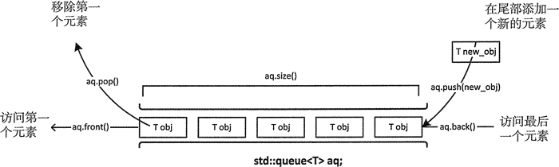

# C++ 容器适配器

## C++ queue容器适配器

和 stack 栈容器适配器不同，queue 容器适配器有 2 个开口，其中一个开口专门用来输入数据，另一个专门用来输出数据，如图 1 所示。



<center>图 1 queue容器适配器</center>

这种存储结构最大的特点是，最先进入 queue 的元素，也可以最先从 queue 中出来，即用此容器适配器存储数据具有“先进先出（简称 "FIFO" ）”的特点，因此 queue 又称为队列适配器。

> 其实，[STL](http://c.biancheng.net/stl/) queue 容器适配器模拟的就是队列这种存储结构，因此对于任何需要用队列进行处理的序列来说，使用 queue 容器适配器都是好的选择。

#### queue容器适配器的创建

queue 容器适配器以模板类 queue<T,Container=deque<T>>（其中 T 为存储元素的类型，Container 表示底层容器的类型）的形式位于<queue>头文件中，并定义在 std 命名空间里。因此，在创建该容器之前，程序中应包含以下 2 行代码：

```c++
#include <queue>
using namespace std;
```

创建 queue 容器适配器的方式大致可分为以下几种。

1) 创建一个空的 queue 容器适配器，其底层使用的基础容器选择默认的 deque 容器：

```c++
std::queue<int> values;
```

通过此行代码，就可以成功创建一个可存储 int 类型元素，底层采用 deque 容器的 queue 容器适配器。

2) 当然，也可以手动指定 queue 容器适配器底层采用的基础容器类型。通过学习 《[STL容器适配器详解](http://c.biancheng.net/view/6967.html)》一节我们知道，queue 容器适配器底层容器可以选择 deque 和 list。

> 作为 queue 容器适配器的基础容器，其必须提供 front()、back()、push_back()、pop_front()、empty() 和 size() 这几个成员函数，符合条件的序列式容器仅有 deque 和 list。

例如，下面创建了一个使用 list 容器作为基础容器的空 queue 容器适配器：

```c++
std::queue<int, std::list<int>> values;
```

注意，在手动指定基础容器的类型时，其存储的数据类型必须和 queue 容器适配器存储的元素类型保持一致。

3) 可以用基础容器来初始化 queue 容器适配器，只要该容器类型和 queue 底层使用的基础容器类型相同即可。例如：

```c++
std::deque<int> values{1,2,3};
std::queue<int> my_queue(values);
```

由于 my_queue 底层采用的是 deque 容器，和 values 类型一致，且存储的也都是 int 类型元素，因此可以用 values 对 my_queue 进行初始化。

4) 还可以直接通过 queue 容器适配器来初始化另一个 queue 容器适配器，只要它们存储的元素类型以及底层采用的基础容器类型相同即可。例如：

```C++
std::deque<int> values{1,2,3};
std::queue<int> my_queue1(values);
std::queue<int> my_queue(my_queue1);
//或者使用
//std::queue<int> my_queue = my_queue1;
```

> 注意，和使用基础容器不同，使用 queue 适配器给另一个 queue 进行初始化时，有 2 种方式，使用哪一种都可以。

值得一提的是，第 3、4 种初始化方法中 my_queue 容器适配器的数据是经过拷贝得来的，也就是说，操作 my_queue 容器适配器中的数据，并不会对 values 容器以及 my_queue1 容器适配器有任何影响；反过来也是如此。

#### queue容器适配器支持的成员函数

queue 容器适配器和 stack 有一些成员函数相似，但在一些情况下，工作方式有些不同。表 2 罗列了 queue 容器支持的全部成员函数。

<center>表 1 queue容器适配器支持的成员函数</center>

| 函数成员                    | 函数功能                                                     |
| --------------------------- | ------------------------------------------------------------ |
| empty()                     | 如果 queue 中没有元素的话，返回 true。                       |
| size()                      | 返回 queue 中元素的个数。                                    |
| front()                     | 返回 queue 中第一个元素的引用。如果 queue 是常量，就返回一个常引用；如果 queue 为空，返回值是未定义的。 |
| back()                      | 返回 queue 中最后一个元素的引用。如果 queue 是常量，就返回一个常引用；如果 queue 为空，返回值是未定义的。 |
| push(const T& obj)          | 在 queue 的尾部添加一个元素的副本。这是通过调用底层容器的成员函数 push_back() 来完成的。 |
| emplace()                   | 在 queue 的尾部直接添加一个元素。                            |
| push(T&& obj)               | 以移动的方式在 queue 的尾部添加元素。这是通过调用底层容器的具有右值引用参数的成员函数 push_back() 来完成的。 |
| pop()                       | 删除 queue 中的第一个元素。                                  |
| swap(queue<T> &other_queue) | 将两个 queue 容器适配器中的元素进行互换，需要注意的是，进行互换的 2 个 queue 容器适配器中存储的元素类型以及底层采用的基础容器类型，都必须相同。 |
> 和 stack 一样，queue 也没有迭代器，因此访问元素的唯一方式是遍历容器，通过不断移除访问过的元素，去访问下一个元素。

下面这个例子中演示了表 2 中部分成员函数的用法：

```c++
#include <iostream>
#include <queue>
#include <list>
using namespace std;
int main()
{
    //构建 queue 容器适配器
    std::deque<int> values{ 1,2,3 };
    std::queue<int> my_queue(values);//{1,2,3}
    //查看 my_queue 存储元素的个数
    cout << "size of my_queue: " << my_queue.size() << endl;
    //访问 my_queue 中的元素
    while (!my_queue.empty())
    {
        cout << my_queue.front() << endl;
        //访问过的元素出队列
        my_queue.pop();
    }
    return 0;
}
```

运行结果为：

size of my_queue: 3
1
2
3

> 表 2 中其它成员函数的用法也非常简单，这里不再给出具体示例，后续章节用法会做具体介绍。